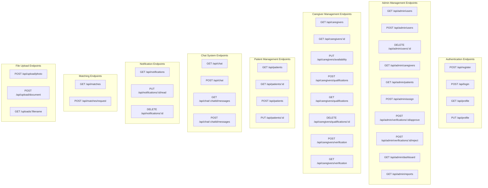
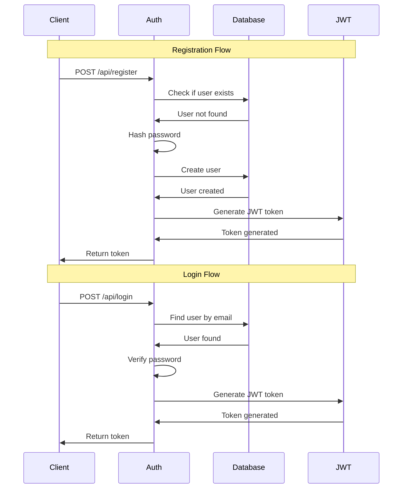
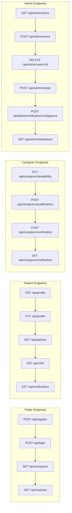
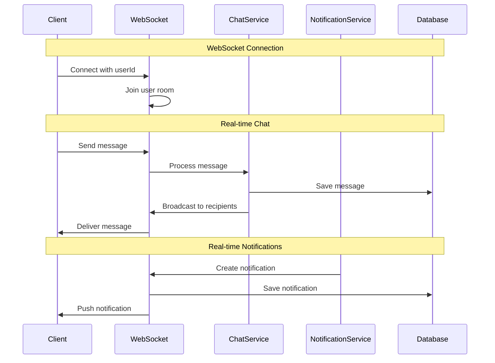
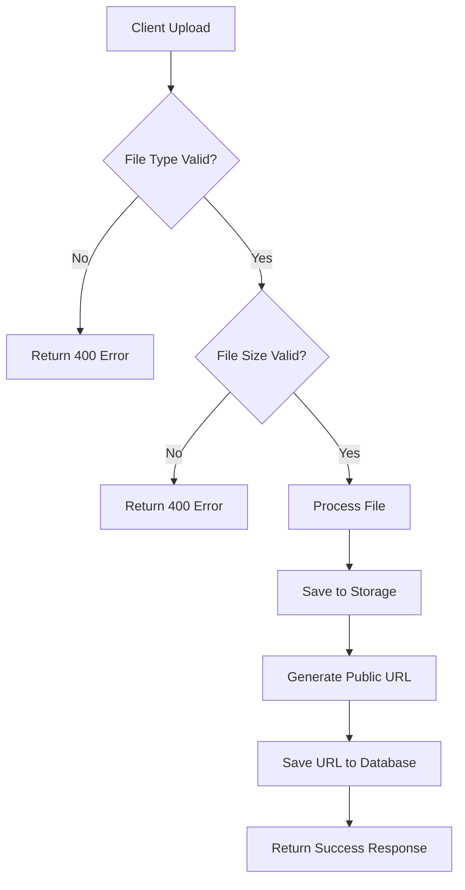
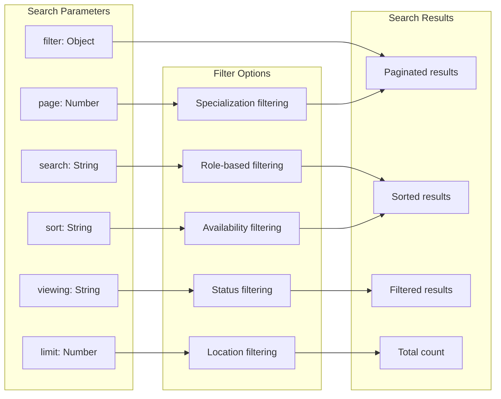
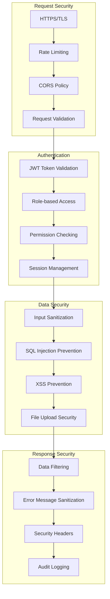
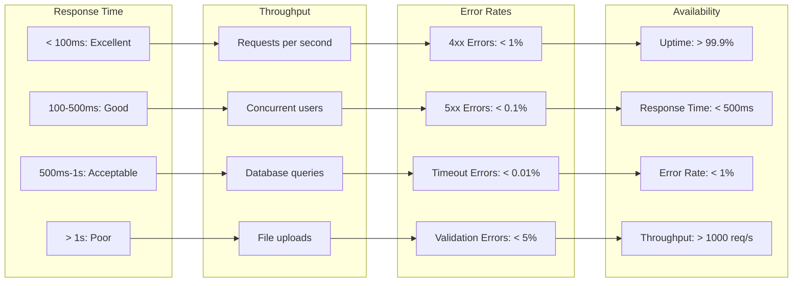

# Express Care App - API Endpoints Diagram

## 🔗 Complete API Endpoints Overview

## 🔐 Authentication Flow

## 👥 User Role Access Matrix

## 📊 API Response Structure

```mermaid
graph TD
    subgraph "Success Response"
        S1[Status: 200/201]
        S2[Data: Object/Array]
        S3[Message: String]
    end
    
    subgraph "Error Response"
        E1[Status: 400/401/403/404/500]
        E2[Error: String]
        E3[Details: Object]
    end
    
    subgraph "Paginated Response"
        P1[Data: Array]
        P2[Pagination: Object]
        P3[Total: Number]
        P4[Page: Number]
        P5[Limit: Number]
    end
    
    S1 --> S2
    S2 --> S3
    
    E1 --> E2
    E2 --> E3
    
    P1 --> P2
    P2 --> P3
    P3 --> P4
    P4 --> P5
```

## 🔄 Real-time API Flow

## 📁 File Upload Flow

## 🔍 API Search & Filtering

## 🛡️ API Security Layers

## 📈 API Performance Metrics

---

This comprehensive API documentation provides a complete overview of all endpoints, their security measures, performance expectations, and real-time capabilities. The Express Care App API is designed to be secure, scalable, and user-friendly while maintaining high performance standards for healthcare applications. 
