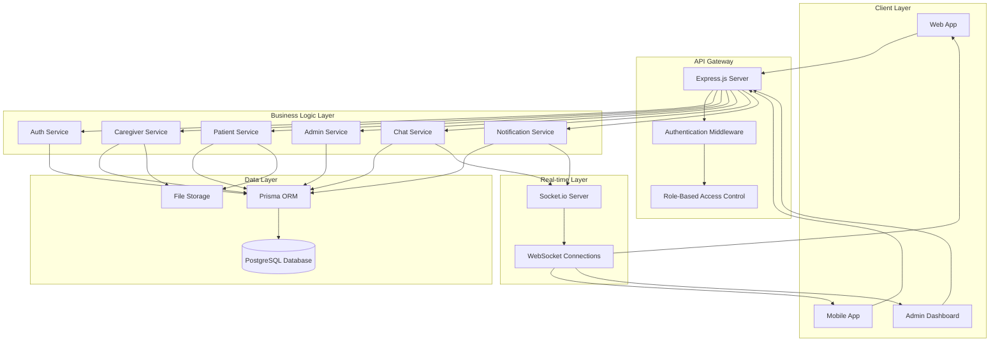
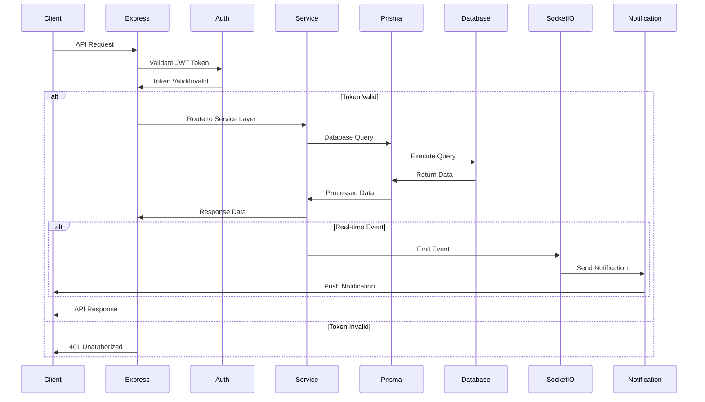
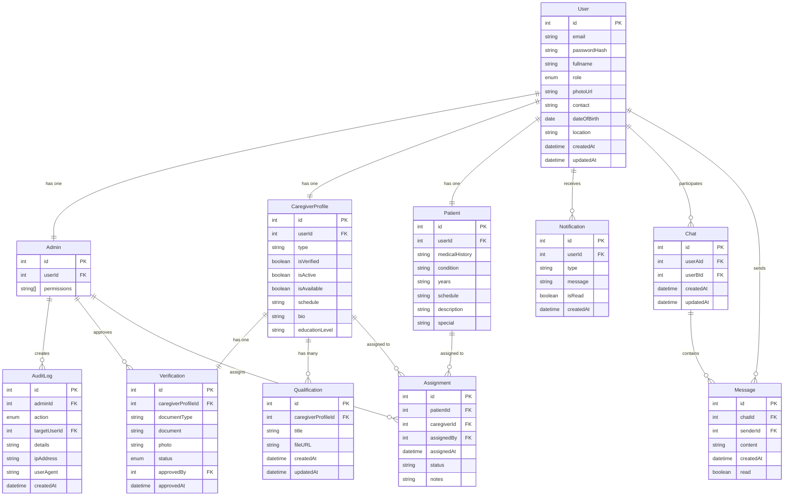
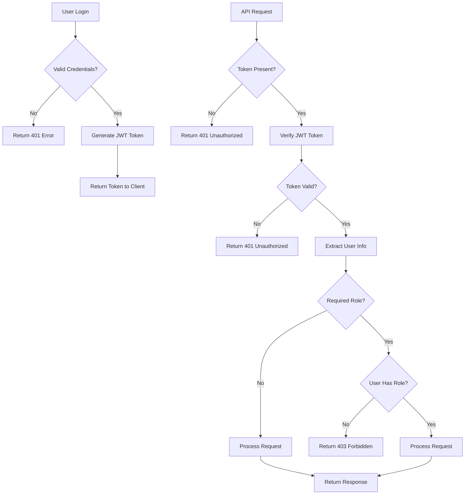
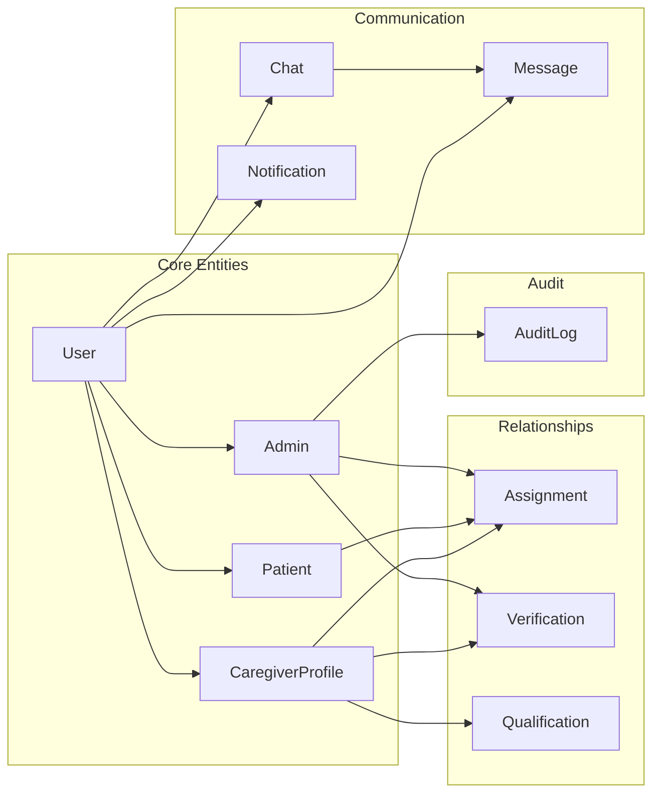
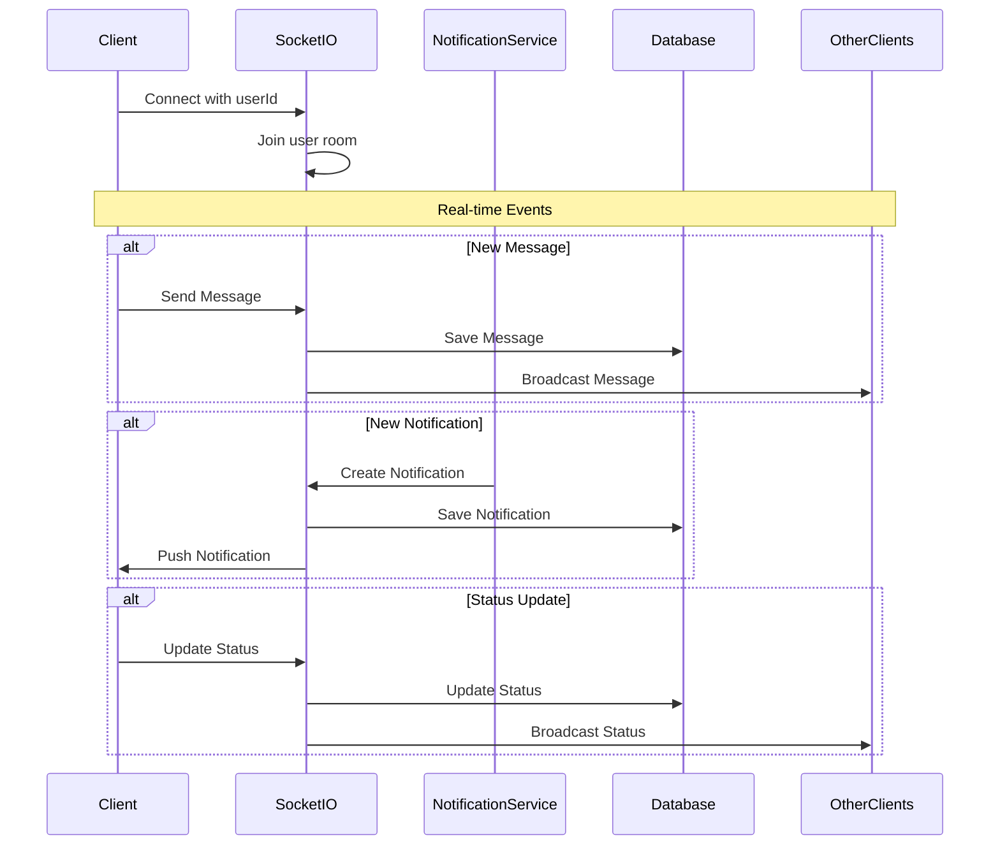
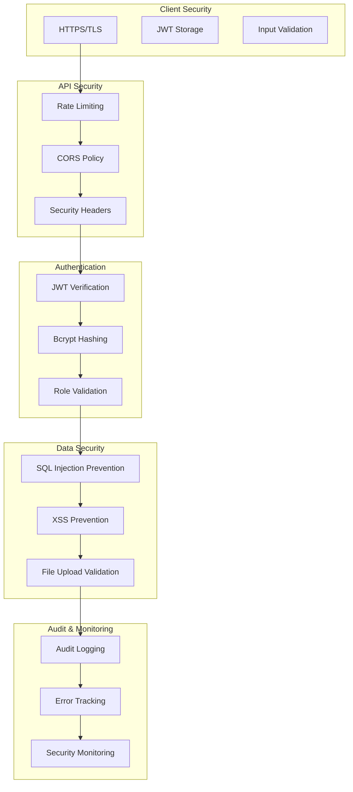
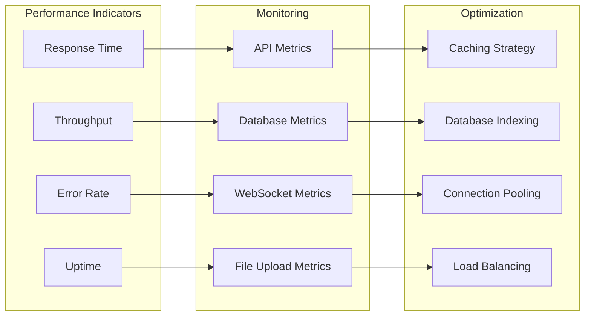

# Express Care App - Architecture Diagrams

## 🏗️ System Architecture Overview

## 🔄 Data Flow Diagram

## 👥 User Role Relationships

## 🔐 Authentication & Authorization Flow

## 📊 Database Schema Relationships

## 🔄 Real-time Communication Flow

## 🛡️ Security Architecture

## 📈 System Performance Metrics

---

These diagrams provide a comprehensive view of the Express Care App's architecture, data flow, security model, and performance considerations. The system is designed to be scalable, secure, and maintainable while providing real-time communication capabilities for healthcare professionals and patients. 