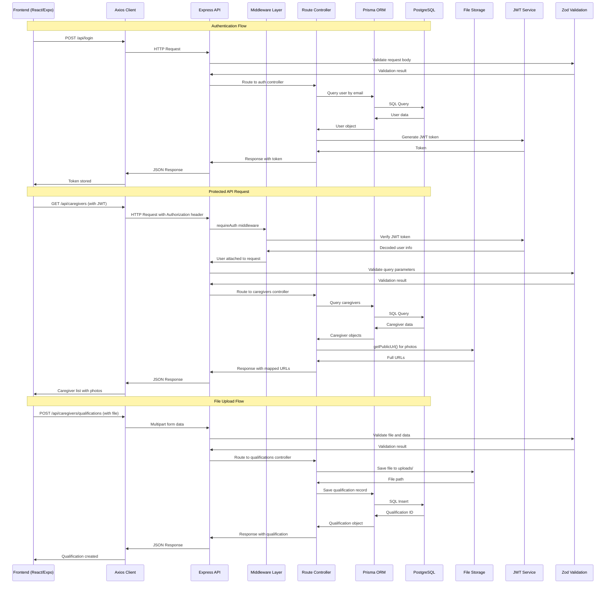
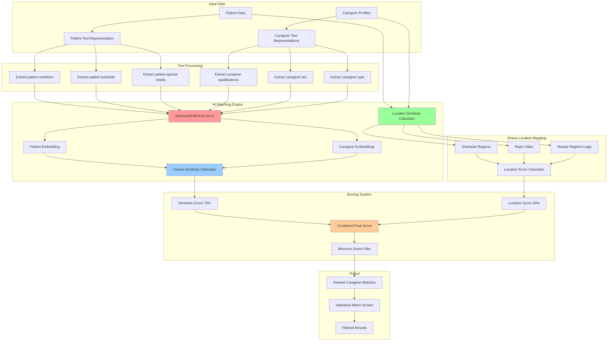
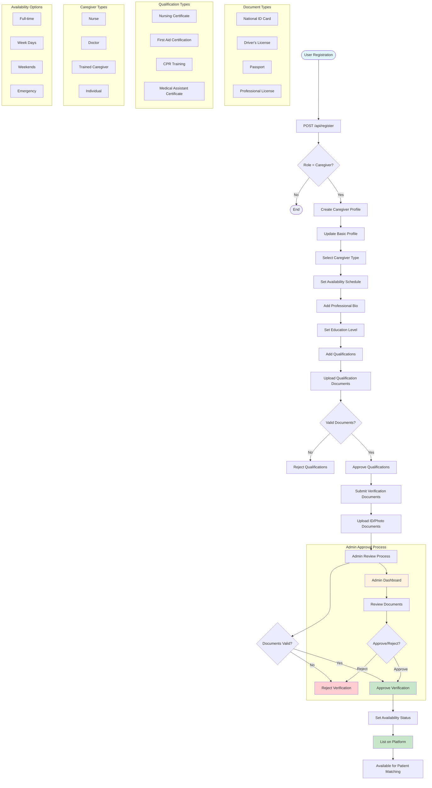
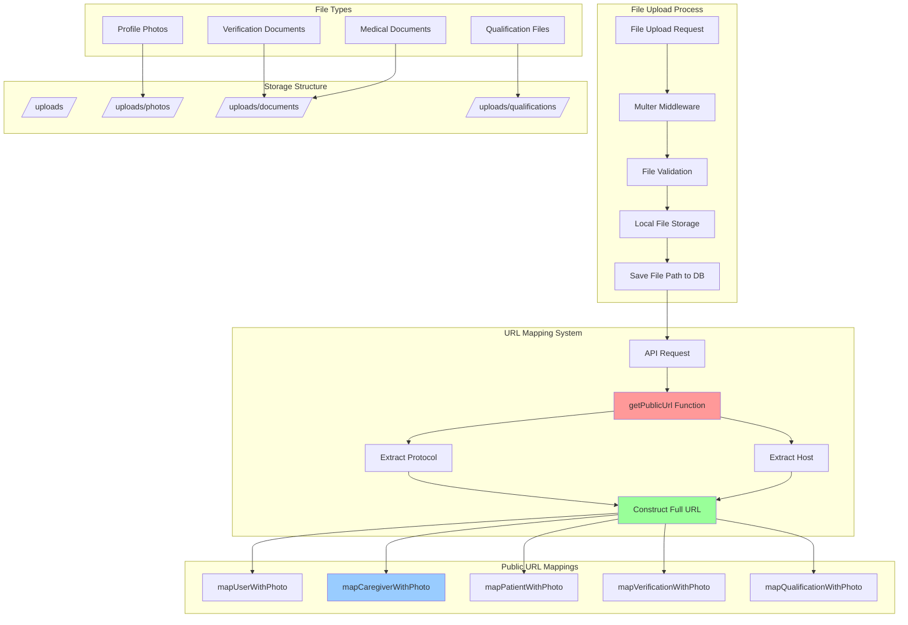
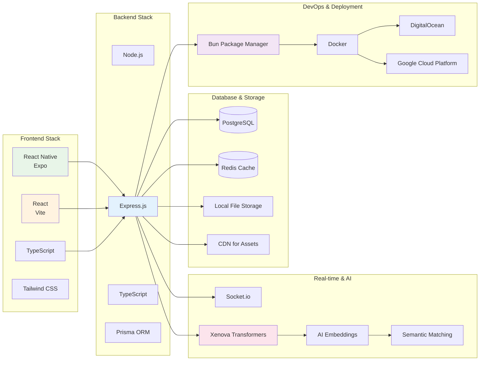

# Family Care Platform - Comprehensive Diagrams

## 🏗️ Platform Overview

**Family Care** is a comprehensive healthcare platform that connects patients with qualified caregivers through:
- **Backend API**: Express.js with TypeScript and Prisma ORM
- **Mobile App**: Expo React Native for caregivers and patients
- **Admin Panel**: Vite React web application for administrators
- **Real-time Features**: WebSocket communication and push notifications

---

## 1. UML Class Diagram - Core Models (Backend)

```mermaid
classDiagram
    class User {
        +Int id
        +String email
        +String passwordHash
        +String fullname
        +Role role
        +String photoUrl
        +String contact
        +DateTime dateOfBirth
        +String location
        +DateTime createdAt
        +DateTime updatedAt
        +createUser()
        +getUserByEmail()
        +getUserById()
    }

    class Admin {
        +Int id
        +Int userId
        +String[] permissions
        +createAdmin()
        +getAllAdmins()
        +auditLog()
    }

    class CaregiverProfile {
        +Int id
        +Int userId
        +String type
        +Boolean isVerified
        +Boolean isActive
        +Boolean isAvailable
        +String schedule
        +String bio
        +String educationLevel
        +createCaregiver()
        +updateCaregiver()
        +getCaregiverById()
    }

    class Patient {
        +Int id
        +Int userId
        +String medicalHistory
        +String condition
        +String years
        +String schedule
        +String description
        +String special
        +createPatient()
        +getPatientById()
        +getAllPatients()
    }

    class Assignment {
        +Int id
        +Int patientId
        +Int caregiverId
        +Int assignedBy
        +DateTime assignedAt
        +String status
        +String notes
        +createAssignment()
        +updateAssignment()
        +getAssignmentsByPatient()
    }

    class Verification {
        +Int id
        +Int caregiverProfileId
        +String documentType
        +String document
        +String photo
        +VerificationStatus status
        +Int approvedBy
        +DateTime approvedAt
        +createVerification()
        +approveVerification()
        +rejectVerification()
    }

    class Qualification {
        +Int id
        +Int caregiverProfileId
        +String title
        +String fileURL
        +DateTime createdAt
        +DateTime updatedAt
        +createQualification()
        +getQualifications()
        +deleteQualification()
    }

    class Chat {
        +Int id
        +Int userAId
        +Int userBId
        +DateTime createdAt
        +DateTime updatedAt
        +createChat()
        +getChatById()
    }

    class Message {
        +Int id
        +Int chatId
        +Int senderId
        +String content
        +DateTime createdAt
        +Boolean read
        +sendMessage()
        +markAsRead()
    }

    class Notification {
        +Int id
        +Int userId
        +String type
        +String message
        +Boolean isRead
        +DateTime createdAt
        +createNotification()
        +markAsRead()
        +getUserNotifications()
    }

    class AuditLog {
        +Int id
        +Int adminId
        +AuditAction action
        +Int targetUserId
        +String details
        +String ipAddress
        +String userAgent
        +DateTime createdAt
        +logAction()
        +getAuditLogs()
    }

    %% Relationships
    User ||--|| Admin : "has one"
    User ||--|| CaregiverProfile : "has one"
    User ||--|| Patient : "has one"
    User ||--o{ Notification : "receives"
    User ||--o{ Chat : "participates"
    User ||--o{ Message : "sends"

    CaregiverProfile ||--|| Verification : "has one"
    CaregiverProfile ||--o{ Qualification : "has many"
    CaregiverProfile ||--o{ Assignment : "assigned to"

    Patient ||--o{ Assignment : "assigned to"

    Admin ||--o{ AuditLog : "creates"
    Admin ||--o{ Verification : "approves"
    Admin ||--o{ Assignment : "assigns"

    Chat ||--o{ Message : "contains"

    %% Inheritance/Shared Fields
    note for User "Base entity with common fields:\n- id, email, fullname, role\n- photoUrl, contact, location\n- createdAt, updatedAt"
    
    note for CaregiverProfile "Extends User with:\n- Professional credentials\n- Availability status\n- Verification status"
    
    note for Patient "Extends User with:\n- Medical information\n- Care requirements\n- Assignment history"
    
    note for Admin "Extends User with:\n- Administrative permissions\n- Audit capabilities\n- System management"
```

---

## 2. API Integration Flow



---

## 3. AI Matching System (@caregiverMatching.ts)



---

## 4. Caregiver Onboarding Flow



---

## 5. File Storage & URL Mapping System



---

## 6. Scalability Plan Overview

```mermaid
graph TB
    subgraph "Current Architecture"
        CA1[Express.js Backend]
        CA2[PostgreSQL Database]
        CA3[Local File Storage]
        CA4[Socket.io WebSockets]
        CA5[Single Server Deployment]
    end

    subgraph "Phase 1: Performance Optimization"
        PO1[Redis Caching Layer]
        PO2[Database Connection Pooling]
        PO3[File Upload Optimization]
        PO4[API Response Caching]
        PO5[CDN for Static Assets]
    end

    subgraph "Phase 2: Infrastructure Scaling"
        IS1[Load Balancer (Nginx)]
        IS2[Multiple API Servers]
        IS3[Database Read Replicas]
        IS4[Redis Cluster]
        IS5[Object Storage (AWS S3/DO Spaces)]
    end

    subgraph "Phase 3: Advanced Features"
        AF1[WebRTC for Video Calls]
        AF2[Push Notifications (FCM/APNS)]
        AF3[Real-time Location Tracking]
        AF4[Advanced Analytics Dashboard]
        AF5[Machine Learning Pipeline]
    end

    subgraph "Phase 4: Cloud Migration"
        CM1[DigitalOcean App Platform]
        CM2[Google Cloud Platform]
        CM3[Kubernetes Orchestration]
        CM4[Auto-scaling Groups]
        CM5[Global CDN Distribution]
    end

    subgraph "Deployment Options"
        DO1[DigitalOcean Droplets]
        DO2[DigitalOcean App Platform]
        DO3[Google Cloud Run]
        DO4[Google Cloud Compute Engine]
        DO5[AWS EC2/AWS ECS]
    end

    CA1 --> PO1
    CA2 --> PO2
    CA3 --> PO3
    CA4 --> PO4
    CA5 --> PO5

    PO1 --> IS1
    PO2 --> IS2
    PO3 --> IS3
    PO4 --> IS4
    PO5 --> IS5

    IS1 --> AF1
    IS2 --> AF2
    IS3 --> AF3
    IS4 --> AF4
    IS5 --> AF5

    AF1 --> CM1
    AF2 --> CM2
    AF3 --> CM3
    AF4 --> CM4
    AF5 --> CM5

    CM1 --> DO1
    CM2 --> DO2
    CM3 --> DO3
    CM4 --> DO4
    CM5 --> DO5

    style CA1 fill:#e3f2fd
    style PO1 fill:#f3e5f5
    style IS1 fill:#e8f5e8
    style AF1 fill:#fff3e0
    style CM1 fill:#fce4ec
```

---

## 7. Platform Architecture Overview

```mermaid
graph TB
    subgraph "Frontend Applications"
        MobileApp[Expo React Native App<br/>Caregivers & Patients]
        AdminPanel[Vite React Admin Panel<br/>Administrators Only]
    end

    subgraph "Backend API Layer"
        ExpressAPI[Express.js API Server<br/>TypeScript + Prisma]
        AuthMiddleware[JWT Authentication<br/>Role-based Access]
        ValidationLayer[Zod Validation<br/>Request/Response]
        FileUpload[Multer File Upload<br/>Document Management]
    end

    subgraph "Real-time Communication"
        SocketIO[Socket.io Server<br/>WebSocket Connections]
        ChatSystem[Real-time Chat<br/>Instant Messaging]
        Notifications[Push Notifications<br/>Event Broadcasting]
    end

    subgraph "Data Layer"
        PostgreSQL[(PostgreSQL Database<br/>Primary Data Store)]
        PrismaORM[Prisma ORM<br/>Database Abstraction)]
        FileStorage[Local File Storage<br/>Uploads Directory]
    end

    subgraph "AI & Matching"
        MatchingEngine[AI Matching Engine<br/>@caregiverMatching.ts]
        EmbeddingModel[Xenova Transformers<br/>Semantic Analysis]
        LocationService[Location Matching<br/>Ghanaian Regions]
        ScoringSystem[Match Scoring<br/>Semantic + Location]
    end

    MobileApp --> ExpressAPI
    AdminPanel --> ExpressAPI
    
    ExpressAPI --> AuthMiddleware
    ExpressAPI --> ValidationLayer
    ExpressAPI --> FileUpload
    
    ExpressAPI --> SocketIO
    SocketIO --> ChatSystem
    SocketIO --> Notifications
    SocketIO --> PresenceTracking
    
    ExpressAPI --> PostgreSQL
    ExpressAPI --> PrismaORM
    ExpressAPI --> FileStorage
    
    ExpressAPI --> MatchingEngine
    MatchingEngine --> EmbeddingModel
    MatchingEngine --> LocationService
    MatchingEngine --> ScoringSystem
    
 

    style MobileApp fill:#e8f5e8
    style AdminPanel fill:#fff3e0
    style ExpressAPI fill:#e3f2fd
    style MatchingEngine fill:#fce4ec
```

---

## 8. Technology Stack Integration



---

## 9. Security & Compliance Architecture

```mermaid
graph TB
    subgraph "Authentication & Authorization"
        JWT[JWT Token System]
        RBAC[Role-Based Access Control]
        PasswordHashing[Bcrypt Password Hashing]
        SessionManagement[Session Management]
    end

    subgraph "Data Protection"
        InputValidation[Zod Input Validation]
        SQLInjection[SQL Injection Prevention]
        XSSPrevention[XSS Prevention]
        FileValidation[File Upload Security]
    end

    subgraph "Audit & Compliance"
        AuditLogging[Comprehensive Audit Logs]
        DataEncryption[Data Encryption at Rest]
        HTTPS[TLS/SSL Encryption]
        GDPRCompliance[GDPR Compliance]
    end

    subgraph "Healthcare Security"
        HIPAACompliance[HIPAA Compliance]
        MedicalDataProtection[Medical Data Protection]
        AccessLogging[Access Logging]
        DataRetention[Data Retention Policies]
    end

    subgraph "Infrastructure Security"
        Firewall[Network Firewall]
        DDoSProtection[DDoS Protection]
        BackupStrategy[Automated Backups]
        DisasterRecovery[Disaster Recovery Plan]
    end

    JWT --> RBAC
    RBAC --> PasswordHashing
    PasswordHashing --> SessionManagement
    
    SessionManagement --> InputValidation
    InputValidation --> SQLInjection
    SQLInjection --> XSSPrevention
    XSSPrevention --> FileValidation
    
    FileValidation --> AuditLogging
    AuditLogging --> DataEncryption
    DataEncryption --> HTTPS
    HTTPS --> GDPRCompliance
    
    GDPRCompliance --> HIPAACompliance
    HIPAACompliance --> MedicalDataProtection
    MedicalDataProtection --> AccessLogging
    AccessLogging --> DataRetention
    
    DataRetention --> Firewall
    Firewall --> DDoSProtection
    DDoSProtection --> BackupStrategy
    BackupStrategy --> DisasterRecovery

    style JWT fill:#e3f2fd
    style AuditLogging fill:#f3e5f5
    style HIPAACompliance fill:#e8f5e8
    style Firewall fill:#fff3e0
```



---

## 10. Mobile App & Admin Panel Integration

```mermaid
graph TB
    subgraph "Mobile App (Expo React Native)"
        MobileAuth[Authentication]
        MobileProfile[Profile Management]
        MobileChat[Real-time Chat]
        MobileNotifications[Push Notifications]
        MobileMatching[Caregiver Matching]
        MobileLocation[Location Services]
    end

    subgraph "Admin Panel (Vite React)"
        AdminAuth[Admin Authentication]
        AdminDashboard[Dashboard Analytics]
        AdminUsers[User Management]
        AdminVerifications[Verification Approval]
        AdminAssignments[Assignment Management]
        AdminReports[Reports & Analytics]
    end

    subgraph "Shared Backend API"
        SharedAPI[Express.js API]
        SharedAuth[JWT Authentication]
        SharedValidation[Zod Validation]
        SharedFileUpload[File Upload]
        SharedWebSocket[Socket.io]
    end

    subgraph "Database & Storage"
        SharedDB[(PostgreSQL)]
        SharedCache[(Redis)]
        SharedStorage[File Storage]
        SharedAI[AI Matching Engine]
    end

    MobileAuth --> SharedAPI
    MobileProfile --> SharedAPI
    MobileChat --> SharedAPI
    MobileNotifications --> SharedAPI
    MobileMatching --> SharedAPI
    MobileLocation --> SharedAPI

    AdminAuth --> SharedAPI
    AdminDashboard --> SharedAPI
    AdminUsers --> SharedAPI
    AdminVerifications --> SharedAPI
    AdminAssignments --> SharedAPI
    AdminReports --> SharedAPI

    SharedAPI --> SharedAuth
    SharedAPI --> SharedValidation
    SharedAPI --> SharedFileUpload
    SharedAPI --> SharedWebSocket

    SharedAuth --> SharedDB
    SharedValidation --> SharedDB
    SharedFileUpload --> SharedStorage
    SharedWebSocket --> SharedCache
    SharedAPI --> SharedAI

    style MobileAuth fill:#e8f5e8
    style AdminAuth fill:#fff3e0
    style SharedAPI fill:#e3f2fd
    style SharedAI fill:#fce4ec
```



---

**Family Care Platform** - A comprehensive healthcare solution connecting patients with qualified caregivers through intelligent matching, real-time communication, and secure administrative oversight. 